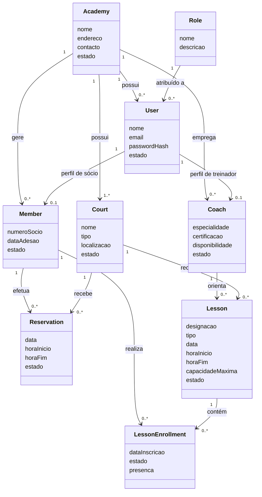

# Modelo de Domínio

# AtlanticaPadel Club Manager (APCM)

> **Simplifying Padel Club Management**

---

## 1. Introdução

O presente documento descreve o modelo de domínio do **AtlanticaPadel Club Manager (APCM)**.

O modelo de domínio representa os principais conceitos existentes no contexto de uma academia de pádel e as relações estabelecidas entre esses conceitos. Nesta fase, o objetivo não é definir tabelas, tipos de dados ou detalhes de implementação, mas compreender a estrutura conceptual do negócio.

Este modelo servirá de base para:

- elaboração do modelo Entidade-Relacionamento;
- modelação da base de dados;
- definição da arquitetura da aplicação;
- implementação dos módulos do backend;
- criação dos endpoints da API;
- desenho das interfaces da aplicação.

---

## 2. Terminologia do Domínio

Embora a documentação do projeto seja redigida em português, os nomes técnicos utilizados no código-fonte, na base de dados e na API serão definidos em inglês.

| Conceito em português | Nome técnico |
|---|---|
| Academia | `Academy` |
| Utilizador | `User` |
| Perfil de acesso | `Role` |
| Sócio | `Member` |
| Treinador | `Coach` |
| Campo | `Court` |
| Reserva | `Reservation` |
| Aula | `Lesson` |
| Inscrição numa aula | `LessonEnrollment` |

Esta abordagem permite manter a documentação académica acessível em português, seguindo simultaneamente convenções comuns no desenvolvimento de software.

---

## 3. Entidades Principais

### 3.1 Academy

A entidade `Academy` representa a academia de pádel que utiliza a plataforma.

A academia agrega os principais recursos e intervenientes do sistema, incluindo campos, utilizadores, sócios, treinadores, reservas e aulas.

#### Principais responsabilidades

- representar a organização;
- armazenar os dados gerais da academia;
- agregar os recursos geridos pela plataforma;
- permitir uma futura evolução para um modelo com várias academias.

#### Informação conceptual

- nome;
- endereço;
- contacto;
- estado da academia.

---

### 3.2 User

A entidade `User` representa uma pessoa com credenciais de acesso à plataforma.

Um utilizador possui um perfil de acesso que determina as funcionalidades que pode consultar ou executar.

#### Principais responsabilidades

- armazenar dados de autenticação;
- identificar o utilizador;
- associar o utilizador a um perfil;
- controlar o acesso à aplicação.

#### Informação conceptual

- nome;
- endereço de correio eletrónico;
- palavra-passe protegida;
- estado da conta;
- perfil de acesso.

---

### 3.3 Role

A entidade `Role` representa o perfil de acesso atribuído a um utilizador.

No APCM Core serão considerados os seguintes perfis:

- Administrador;
- Rececionista;
- Treinador;
- Sócio.

O perfil de Proprietário da Academia encontra-se previsto para uma evolução futura.

#### Principais responsabilidades

- identificar o tipo de utilizador;
- determinar o nível de acesso;
- suportar mecanismos de autorização;
- restringir funcionalidades de acordo com as responsabilidades do utilizador.

---

### 3.4 Member

A entidade `Member` representa um sócio ou cliente da academia.

Um sócio pode efetuar reservas, participar em aulas e consultar o seu histórico de atividade.

#### Principais responsabilidades

- representar os clientes da academia;
- manter os dados específicos do sócio;
- associar reservas ao sócio;
- associar inscrições em aulas ao sócio.

#### Informação conceptual

- número de sócio;
- contacto;
- data de adesão;
- estado do sócio;
- observações.

---

### 3.5 Coach

A entidade `Coach` representa um treinador da academia.

Um treinador pode estar associado a várias aulas e consultar a respetiva agenda.

#### Principais responsabilidades

- representar os treinadores;
- armazenar informação profissional;
- permitir a associação a aulas;
- disponibilizar a agenda do treinador.

#### Informação conceptual

- especialidade;
- nível de certificação;
- disponibilidade;
- estado do treinador.

---

### 3.6 Court

A entidade `Court` representa um campo de pádel pertencente à academia.

Cada campo pode receber reservas e aulas, desde que esteja disponível no período solicitado.

#### Principais responsabilidades

- representar os campos disponíveis;
- indicar o estado operacional;
- suportar a consulta de disponibilidade;
- associar reservas e aulas.

#### Informação conceptual

- nome ou número;
- localização;
- tipo;
- estado;
- horário de funcionamento.

---

### 3.7 Reservation

A entidade `Reservation` representa a utilização planeada de um campo durante um período determinado.

Uma reserva é associada a um campo e a um sócio, podendo ser criada por um administrador ou rececionista.

#### Principais responsabilidades

- registar a ocupação de um campo;
- associar o campo ao sócio;
- armazenar o período da reserva;
- controlar o estado da reserva;
- impedir sobreposição de horários.

#### Informação conceptual

- data;
- hora de início;
- hora de fim;
- estado;
- observações.

#### Estados possíveis

- Pendente;
- Confirmada;
- Cancelada;
- Concluída.

---

### 3.8 Lesson

A entidade `Lesson` representa uma aula individual ou coletiva realizada na academia.

Cada aula é associada a um treinador e a um campo, podendo incluir vários sócios através de inscrições.

#### Principais responsabilidades

- organizar as aulas;
- associar treinador e campo;
- definir data e horário;
- controlar o número máximo de participantes;
- permitir a inscrição de sócios.

#### Informação conceptual

- designação;
- tipo de aula;
- data;
- hora de início;
- hora de fim;
- capacidade máxima;
- estado.

---

### 3.9 LessonEnrollment

A entidade `LessonEnrollment` representa a inscrição de um sócio numa aula.

Esta entidade é necessária porque uma aula pode incluir vários sócios e um sócio pode participar em várias aulas.

#### Principais responsabilidades

- relacionar um sócio com uma aula;
- registar a data de inscrição;
- controlar o estado da inscrição;
- permitir futuramente o registo de presenças.

#### Informação conceptual

- data de inscrição;
- estado;
- presença.

---

## 4. Relações entre Entidades

As principais relações do domínio são:

- uma `Academy` possui vários `Users`;
- uma `Academy` possui vários `Members`;
- uma `Academy` possui vários `Coaches`;
- uma `Academy` possui vários `Courts`;
- um `User` possui um `Role`;
- um `User` pode estar associado a um perfil de `Member`;
- um `User` pode estar associado a um perfil de `Coach`;
- um `Member` pode efetuar várias `Reservations`;
- um `Court` pode receber várias `Reservations`;
- um `Coach` pode orientar várias `Lessons`;
- um `Court` pode receber várias `Lessons`;
- uma `Lesson` pode ter várias inscrições;
- um `Member` pode inscrever-se em várias aulas;
- cada `LessonEnrollment` relaciona um `Member` com uma `Lesson`.

---

## 5. Diagrama Conceptual do Domínio

O seguinte diagrama representa, de forma simplificada, as principais entidades do APCM Core e as respetivas relações.

> **Nota:** Este diagrama em Mermaid constitui uma representação de trabalho. A versão final destinada ao relatório será elaborada numa ferramenta de modelação, como o diagrams.net, e exportada em formato vetorial.

---

## 6. Regras de Negócio Principais

O modelo de domínio deve respeitar as seguintes regras:

### RB-001 — Associação de utilizador a perfil

Cada utilizador deve possuir um perfil de acesso válido.

### RB-002 — Unicidade do endereço de correio eletrónico

Não podem existir dois utilizadores com o mesmo endereço de correio eletrónico.

### RB-003 — Disponibilidade do campo

Uma reserva apenas pode ser criada caso o campo se encontre ativo e disponível.

### RB-004 — Sobreposição de reservas

Não podem existir duas reservas para o mesmo campo em períodos sobrepostos.

### RB-005 — Associação da reserva

Cada reserva deve estar associada a um campo e a um sócio.

### RB-006 — Associação da aula

Cada aula deve estar associada a um treinador e a um campo.

### RB-007 — Capacidade da aula

O número de inscrições numa aula não pode ultrapassar a sua capacidade máxima.

### RB-008 — Conflito entre aula e reserva

Um campo não pode possuir uma aula e uma reserva em períodos sobrepostos.

### RB-009 — Estado das entidades

Sócios, treinadores e campos inativos não devem poder ser associados a novas operações.

### RB-010 — Cancelamento

Uma reserva cancelada deixa de ocupar o respetivo período no calendário do campo.

---

## 7. Entidades Não Incluídas no APCM Core

Algumas entidades relevantes para uma versão comercial foram deliberadamente excluídas do APCM Core.

### Payment

Poderá representar pagamentos de reservas, aulas, mensalidades e pacotes.

### MembershipPlan

Poderá representar planos de adesão, mensalidades e benefícios atribuídos aos sócios.

### Notification

Poderá representar notificações enviadas por correio eletrónico, SMS ou aplicação móvel.

### Tournament

Poderá representar torneios, inscrições, equipas, resultados e quadros competitivos.

### MatchAnalysis

Poderá representar vídeos, eventos e estatísticas produzidos pelo futuro módulo APCM AI.

Estas entidades ficam registadas como parte da visão de evolução da plataforma, mas não serão incluídas na implementação inicial.

---

## 8. Relação com os Módulos do APCM Core

| Entidade | Módulo principal |
|---|---|
| `Academy` | Configuração da academia |
| `User` | Autenticação e utilizadores |
| `Role` | Autorização e permissões |
| `Member` | Gestão de sócios |
| `Coach` | Gestão de treinadores |
| `Court` | Gestão de campos |
| `Reservation` | Gestão de reservas |
| `Lesson` | Gestão de aulas |
| `LessonEnrollment` | Inscrições em aulas |

---

## 9. Considerações Finais

O modelo de domínio apresentado identifica os conceitos fundamentais necessários ao funcionamento do APCM Core.

A separação entre o modelo conceptual e o modelo físico da base de dados permite analisar o domínio sem dependência de tecnologias específicas. Posteriormente, estas entidades serão transformadas num modelo Entidade-Relacionamento e implementadas através de PostgreSQL e Prisma.

A definição antecipada das entidades, relações e regras de negócio reduz ambiguidades durante o desenvolvimento e garante maior coerência entre os requisitos, a base de dados, a API e a interface da aplicação.