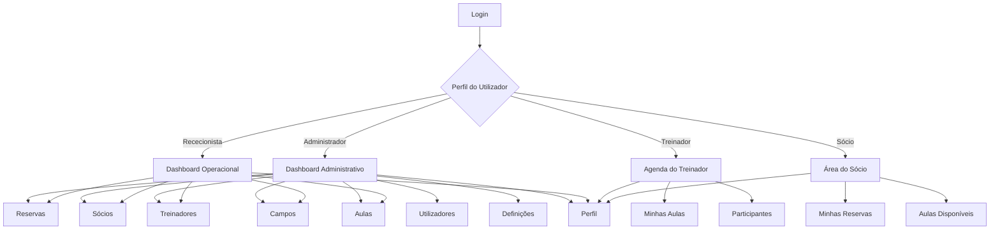

# Site Map

# AtlanticaPadel Club Manager (APCM)

> **Simplifying Padel Club Management**

---

## 1. Introdução

O presente documento define o mapa de navegação do **AtlanticaPadel Club Manager (APCM)**.

O Site Map representa a organização hierárquica das páginas e funcionalidades da aplicação, permitindo compreender como os diferentes utilizadores navegam entre os vários módulos do sistema.

A definição antecipada da estrutura de navegação permite:

- organizar a interface da aplicação;
- reduzir ambiguidades durante o desenvolvimento;
- facilitar a criação dos wireframes;
- garantir consistência entre páginas;
- adaptar a navegação aos diferentes perfis de utilizador;
- apoiar a implementação do controlo de acessos.

---

## 2. Estrutura Geral da Aplicação

A aplicação será organizada em duas áreas principais:

1. **Área Pública**
2. **Área Autenticada**

A Área Pública permite o acesso inicial à plataforma.

A Área Autenticada contém os módulos operacionais do APCM Core e apenas pode ser acedida por utilizadores com sessão iniciada.

```text
APCM
│
├── Área Pública
│   └── Login
│
└── Área Autenticada
    ├── Dashboard
    ├── Reservas
    ├── Sócios
    ├── Treinadores
    ├── Campos
    ├── Aulas
    ├── Perfil
    └── Terminar Sessão
```

---

## 3. Área Pública

### 3.1 Página de Login

A página de Login constitui o ponto de entrada da aplicação.

#### Funcionalidades

- introdução do endereço de correio eletrónico;
- introdução da palavra-passe;
- autenticação do utilizador;
- apresentação de mensagens de erro;
- acesso futuro à recuperação de palavra-passe.

#### Rota prevista

```text
/login
```

#### Atores

- Administrador;
- Rececionista;
- Treinador;
- Sócio.

---

## 4. Área Autenticada

Após autenticação, o utilizador será encaminhado para a área correspondente ao seu perfil.

A navegação principal será apresentada através de uma barra lateral ou menu equivalente.

---

## 5. Dashboard

O Dashboard apresenta um resumo da atividade da academia.

### Funcionalidades

- número total de sócios;
- número total de treinadores;
- reservas do dia;
- aulas agendadas;
- ocupação dos campos;
- acessos rápidos aos módulos principais.

### Rotas previstas

```text
/dashboard
```

### Atores

- Administrador;
- Rececionista.

---

## 6. Reservas

O módulo de Reservas permite consultar e gerir a ocupação dos campos.

### Estrutura

```text
Reservas
│
├── Calendário de Reservas
├── Lista de Reservas
├── Nova Reserva
└── Detalhes da Reserva
    ├── Editar Reserva
    └── Cancelar Reserva
```

### 6.1 Calendário de Reservas

Apresenta a ocupação dos campos por data e horário.

#### Rota prevista

```text
/reservations/calendar
```

### 6.2 Lista de Reservas

Apresenta todas as reservas registadas, com filtros e pesquisa.

#### Rota prevista

```text
/reservations
```

### 6.3 Nova Reserva

Permite criar uma nova reserva.

#### Rota prevista

```text
/reservations/new
```

### 6.4 Detalhes da Reserva

Apresenta os dados completos de uma reserva.

#### Rota prevista

```text
/reservations/{id}
```

### Atores

- Administrador;
- Rececionista;
- Sócio, apenas para consulta das próprias reservas.

---

## 7. Sócios

O módulo de Sócios permite gerir os clientes da academia.

### Estrutura

```text
Sócios
│
├── Lista de Sócios
├── Novo Sócio
└── Perfil do Sócio
    ├── Editar Dados
    ├── Histórico de Reservas
    └── Histórico de Aulas
```

### 7.1 Lista de Sócios

Apresenta a lista de sócios registados.

#### Rota prevista

```text
/members
```

### 7.2 Novo Sócio

Permite registar um novo sócio.

#### Rota prevista

```text
/members/new
```

### 7.3 Perfil do Sócio

Apresenta a informação detalhada de um sócio.

#### Rota prevista

```text
/members/{id}
```

### 7.4 Editar Sócio

Permite atualizar os dados do sócio.

#### Rota prevista

```text
/members/{id}/edit
```

### Atores

- Administrador;
- Rececionista.

---

## 8. Treinadores

O módulo de Treinadores permite gerir a equipa técnica.

### Estrutura

```text
Treinadores
│
├── Lista de Treinadores
├── Novo Treinador
└── Perfil do Treinador
    ├── Editar Dados
    └── Consultar Agenda
```

### 8.1 Lista de Treinadores

Apresenta os treinadores registados.

#### Rota prevista

```text
/coaches
```

### 8.2 Novo Treinador

Permite registar um novo treinador.

#### Rota prevista

```text
/coaches/new
```

### 8.3 Perfil do Treinador

Apresenta a informação detalhada do treinador.

#### Rota prevista

```text
/coaches/{id}
```

### 8.4 Editar Treinador

Permite atualizar os dados do treinador.

#### Rota prevista

```text
/coaches/{id}/edit
```

### 8.5 Agenda do Treinador

Apresenta as aulas atribuídas ao treinador.

#### Rota prevista

```text
/coaches/{id}/schedule
```

### Atores

- Administrador;
- Rececionista, apenas para consulta;
- Treinador, apenas para consulta da própria agenda.

---

## 9. Campos

O módulo de Campos permite gerir os recursos físicos da academia.

### Estrutura

```text
Campos
│
├── Lista de Campos
├── Novo Campo
└── Detalhes do Campo
    ├── Editar Campo
    └── Consultar Disponibilidade
```

### 9.1 Lista de Campos

Apresenta todos os campos registados.

#### Rota prevista

```text
/courts
```

### 9.2 Novo Campo

Permite registar um novo campo.

#### Rota prevista

```text
/courts/new
```

### 9.3 Detalhes do Campo

Apresenta os dados e o estado atual do campo.

#### Rota prevista

```text
/courts/{id}
```

### 9.4 Editar Campo

Permite atualizar os dados do campo.

#### Rota prevista

```text
/courts/{id}/edit
```

### 9.5 Disponibilidade do Campo

Apresenta os períodos livres e ocupados.

#### Rota prevista

```text
/courts/{id}/availability
```

### Atores

- Administrador;
- Rececionista, apenas para consulta.

---

## 10. Aulas

O módulo de Aulas permite gerir treinos individuais e coletivos.

### Estrutura

```text
Aulas
│
├── Calendário de Aulas
├── Lista de Aulas
├── Nova Aula
└── Detalhes da Aula
    ├── Editar Aula
    ├── Gerir Inscrições
    └── Consultar Participantes
```

### 10.1 Calendário de Aulas

Apresenta as aulas organizadas por data e horário.

#### Rota prevista

```text
/lessons/calendar
```

### 10.2 Lista de Aulas

Apresenta todas as aulas registadas.

#### Rota prevista

```text
/lessons
```

### 10.3 Nova Aula

Permite criar uma aula.

#### Rota prevista

```text
/lessons/new
```

### 10.4 Detalhes da Aula

Apresenta a informação da aula, treinador, campo e participantes.

#### Rota prevista

```text
/lessons/{id}
```

### 10.5 Editar Aula

Permite atualizar os dados da aula.

#### Rota prevista

```text
/lessons/{id}/edit
```

### 10.6 Inscrições

Permite inscrever ou remover sócios da aula.

#### Rota prevista

```text
/lessons/{id}/enrollments
```

### Atores

- Administrador;
- Rececionista, para consulta;
- Treinador, para consulta das aulas atribuídas;
- Sócio, para consulta das aulas disponíveis.

---

## 11. Perfil do Utilizador

O módulo de Perfil permite consultar a informação do utilizador autenticado.

### Funcionalidades

- consultar dados pessoais;
- editar dados permitidos;
- consultar o perfil de acesso;
- alterar palavra-passe numa versão futura.

### Rotas previstas

```text
/profile
/profile/edit
```

### Atores

- Todos os utilizadores autenticados.

---

## 12. Administração de Utilizadores

Este módulo permite gerir as contas de acesso à plataforma.

### Estrutura

```text
Utilizadores
│
├── Lista de Utilizadores
├── Novo Utilizador
└── Detalhes do Utilizador
    ├── Editar Utilizador
    ├── Alterar Perfil
    └── Ativar ou Desativar Conta
```

### Rotas previstas

```text
/users
/users/new
/users/{id}
/users/{id}/edit
```

### Atores

- Administrador.

---

## 13. Definições da Academia

Este módulo permite consultar e atualizar os dados gerais da academia.

### Funcionalidades

- nome da academia;
- endereço;
- contactos;
- horário de funcionamento;
- identidade visual;
- configurações gerais.

### Rota prevista

```text
/settings
```

### Atores

- Administrador.

### Nota de âmbito

A implementação completa deste módulo poderá ser reduzida no APCM Core, dependendo do tempo disponível.

---

## 14. Terminar Sessão

A funcionalidade de Logout permite terminar a sessão autenticada.

### Fluxo

1. O utilizador seleciona a opção de terminar sessão.
2. O sistema elimina ou invalida a sessão.
3. O utilizador é redirecionado para a página de Login.

### Atores

- Todos os utilizadores autenticados.

---

## 15. Navegação por Perfil

### 15.1 Administrador

```text
Dashboard
├── Reservas
├── Sócios
├── Treinadores
├── Campos
├── Aulas
├── Utilizadores
├── Definições
├── Perfil
└── Terminar Sessão
```

### 15.2 Rececionista

```text
Dashboard
├── Reservas
├── Sócios
├── Treinadores — consulta
├── Campos — consulta
├── Aulas — consulta
├── Perfil
└── Terminar Sessão
```

### 15.3 Treinador

```text
Agenda
├── Minhas Aulas
├── Participantes
├── Perfil
└── Terminar Sessão
```

### 15.4 Sócio

```text
Área do Sócio
├── Minhas Reservas
├── Aulas Disponíveis
├── Meu Perfil
└── Terminar Sessão
```

### Nota de implementação

No APCM Core, a prioridade será dada à área administrativa e operacional.

As áreas específicas de Treinador e Sócio poderão ser implementadas de forma simplificada ou representadas através de interfaces preparadas para evolução futura.

---

## 16. Diagrama do Site Map

O seguinte diagrama apresenta a estrutura geral de navegação da aplicação.



> **Nota:** O diagrama Mermaid constitui uma representação de trabalho. A versão final destinada ao relatório será produzida em diagrams.net e exportada em formato vetorial.

---

## 17. Relação com os Casos de Uso

| Área da Aplicação | Casos de Uso Relacionados |
|---|---|
| Login | UC-001 |
| Dashboard | UC-002 |
| Sócios | UC-003 |
| Treinadores | UC-004 e UC-008 |
| Campos | UC-005 |
| Reservas | UC-006 |
| Aulas | UC-007 e UC-008 |
| Perfil | UC-009 |
| Logout | UC-010 |

---

## 18. Priorização das Páginas do APCM Core

### Prioridade Alta

- Login;
- Dashboard;
- Lista de Reservas;
- Calendário de Reservas;
- Nova Reserva;
- Lista de Sócios;
- Novo Sócio;
- Lista de Treinadores;
- Lista de Campos;
- Lista de Aulas.

### Prioridade Média

- Detalhes e edição de reservas;
- Perfil do sócio;
- Perfil do treinador;
- Agenda do treinador;
- Detalhes do campo;
- Detalhes da aula;
- Gestão de inscrições.

### Prioridade Baixa

- Gestão completa de utilizadores;
- Definições avançadas da academia;
- área autónoma do Sócio;
- área autónoma do Treinador;
- recuperação de palavra-passe.

---

## 19. Considerações Finais

O Site Map apresentado define a estrutura de navegação prevista para o APCM Core e estabelece a relação entre os módulos funcionais, as páginas da aplicação e os diferentes perfis de utilizador.

A organização proposta privilegia o acesso rápido às funcionalidades operacionais mais importantes, nomeadamente reservas, sócios, treinadores, campos e aulas.

A priorização das páginas permite manter o desenvolvimento alinhado com o prazo disponível, concentrando inicialmente o esforço na área administrativa e operacional. As áreas específicas de Sócio e Treinador poderão ser simplificadas no MVP e desenvolvidas de forma mais completa em versões futuras da plataforma.
